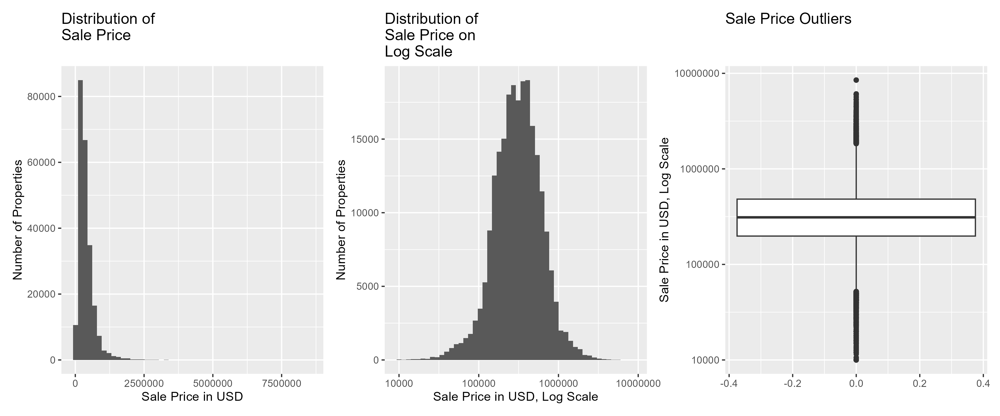
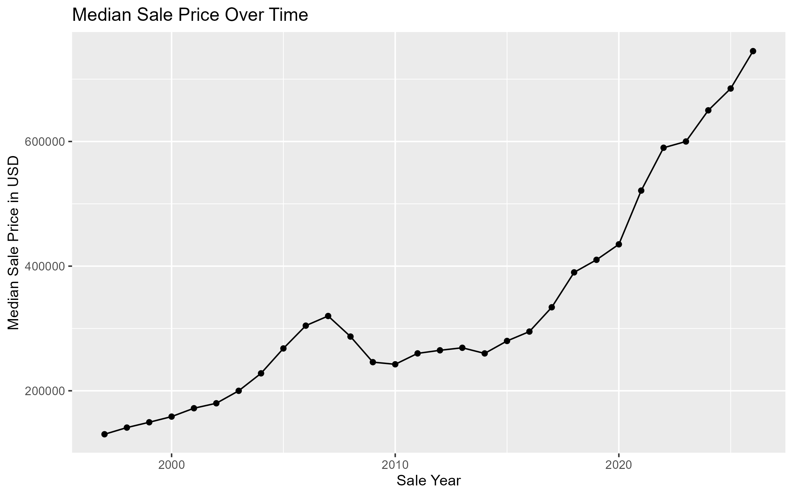
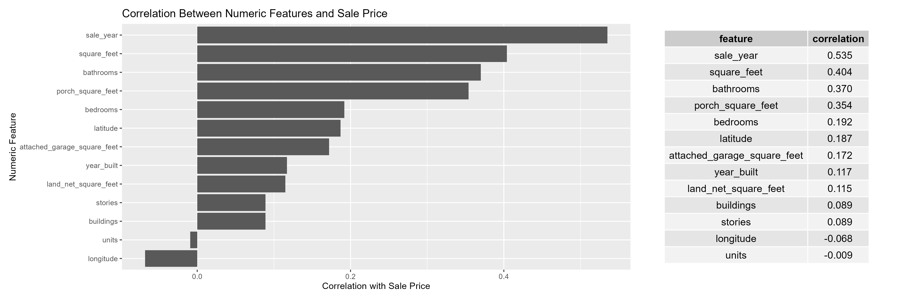
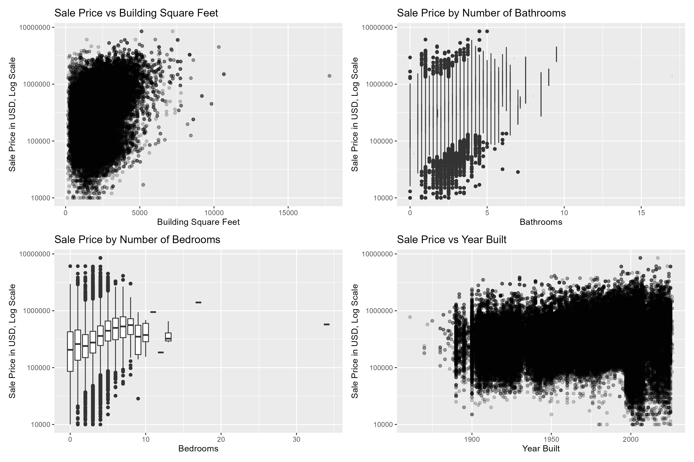
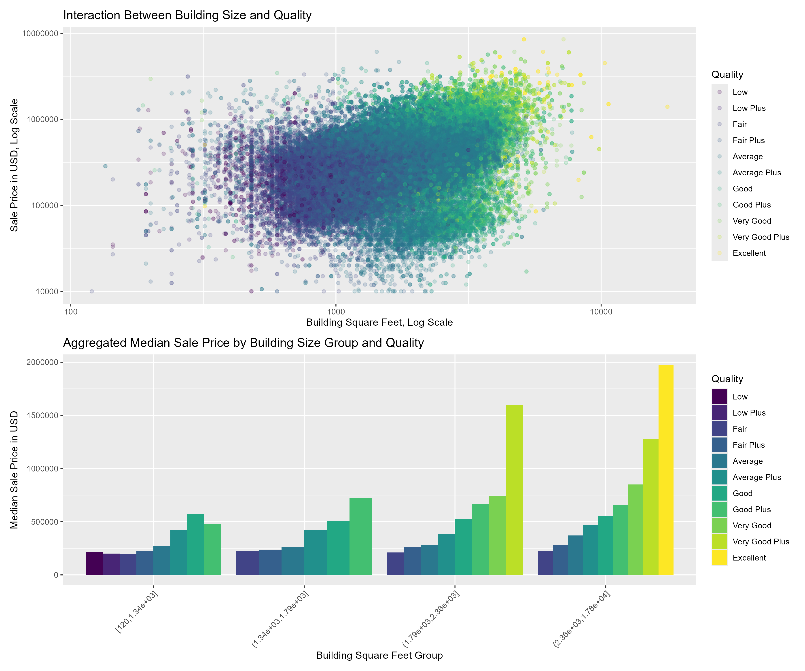
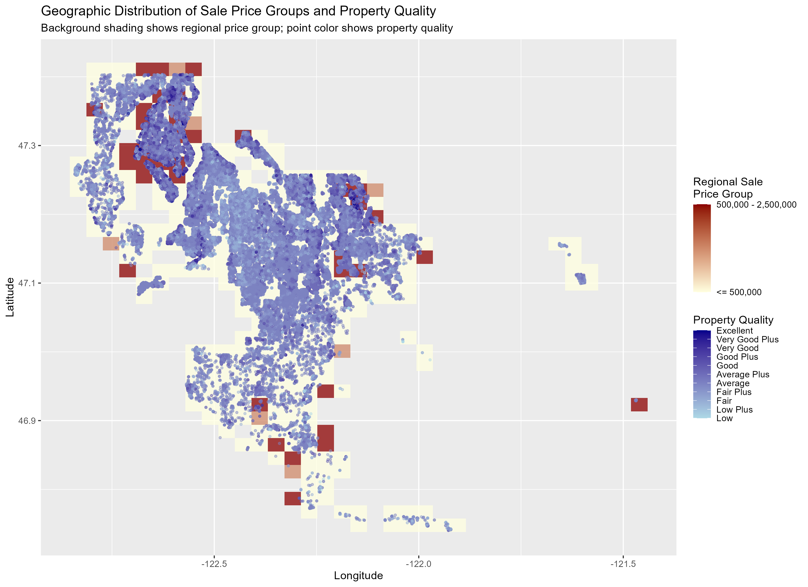

## EDA Summary

File saved under: /workspaces/SOE-R-House-Price-Prediction/analysis/00-eda-analysis/eda.qmd

Before performing the final exploratory analysis, several data preparation and cleaning steps were completed. The goal was to create a clean, meaningful, and residential-focused dataset that can later be used for house price prediction.

### Step 1: Loaded and described the raw data sources

The project started by loading several property-related text files. Each file represented a different part of the property data:

-   sales transactions

-   appraisal account information

-   improvement/building information

-   improvement built-as information

-   improvement detail information

-   land attributes

-   parcel segregation and merge history

-   tax account information

Because the raw text files did not contain column headers, meaningful column names were manually assigned based on the official data documentation.

### Step 2: Checked basic data quality

A data quality check was performed for each table. This included checking:

-   number of rows

-   number of columns

-   duplicate rows

-   total missing values

-   number of columns with missing values

The data quality check showed that there were no full duplicate rows in the original tables. However, several columns contained missing values and needed further inspection.

### Step 3: Checked repeated parcel numbers

The `parcel_number` variable was checked because it is the main key used to connect the data sources.

This step showed that some tables contain repeated parcel numbers, while others contain only one row per parcel. This was important because repeated parcel numbers can create one-to-many relationships during joins.

### Step 4: Analyzed missing values by column

Missing values were inspected at the column level. Columns with very high missingness were identified and reviewed.

Several variables with more than 80% missing values were removed because they were unlikely to provide reliable information for analysis or modeling.

Examples include:

-   `waterfront_type`

-   `view_quality`

-   `group_account_number`

-   `business_name`

-   `submerged_area_square_feet`

-   mobile-home-specific variables

-   basement and garage-related variables with very high missingness

-   exemption and current-use-code variables in the tax table

### Step 5: Removed high-missing columns

After reviewing missingness, selected columns were removed from the appraisal account, improvement, improvement built-as, and tax account tables.

This reduced noise and made the dataset more suitable for analysis.

### Step 6: Filtered valid and confirmed sales

The sales table was filtered to keep only transactions that were:

-   valid

-   confirmed

-   not excluded

-   not missing sale price

-   greater than zero

This step was important because the target variable, `sale_price`, should represent normal market transactions as much as possible.

### Step 7: Joined the data sources

The cleaned tables were joined into one analysis dataset.

The sales table was used as the base table because it contains the target variable, `sale_price`. Other tables were joined using `parcel_number` and, where necessary, `building_id`.

Some row duplication after joining was expected because several tables contain multiple records per parcel or building.

### Step 8: Removed columns with no useful variation

After joining the data, the number of unique values was checked for each column.

Columns with only one unique value were removed because they do not provide useful information for analysis or modeling.

### Step 9: Removed identifier and irrelevant columns

Several columns were removed because they were identifiers, administrative fields, detailed text labels, or variables not useful for prediction.

Examples include:

-   transaction IDs

-   parcel IDs

-   building IDs

-   grantor and grantee names

-   site address

-   tax area codes

-   subdivision name

-   raw descriptive text fields that were replaced by grouped variables

### Step 10: Engineered grouped categorical features

Several detailed categorical variables were simplified into broader groups.

This made the dataset easier to interpret and reduced the number of categories.

The main grouped features were:

-   `utility_electric`

-   `utility_sewer`

-   `utility_water`

-   `street_type`

-   `primary_occupancy_group`

-   `hvac_group`

-   `detail_group`

-   `use_group`

### Step 11: Created boolean amenity features

The detailed improvement descriptions were used to create boolean features that indicate whether certain property features are present.

The created amenity indicators include:

-   `has_bath_detail`

-   `has_garage_or_carport_detail`

-   `has_deck_or_porch_detail`

-   `has_pool_or_spa_detail`

-   `has_fireplace_detail`

-   `has_storage_detail`

-   `has_waterfront_detail`

-   `has_parking_detail`

-   `has_finished_space_detail`

These features helped turn complex text descriptions into simpler variables that can be used in analysis and modeling.

### Step 12: Converted date variables

The date columns were converted into proper date format.

The most important date variable was `sale_date`, which was later used to create `sale_year`.

This allowed the analysis of sale price trends over time.

### Step 13: Checked categorical redundancy with Cramér's V

Cramér's V was used to examine associations between categorical variables.

This helped identify categorical variables that contained overlapping or redundant information.

Based on this analysis, several categorical variables were removed, especially those that were administrative, duplicated information, or replaced by grouped versions.

### Step 14: Checked numeric redundancy with correlations

A numeric correlation matrix was used to check relationships between numeric variables.

This helped identify highly correlated variables and variables that could create multicollinearity.

Assessor-value variables were also removed because they may leak information about the target variable `sale_price`.

Examples of removed numeric variables include:

-   prior and current assessed land values

-   prior and current improvement values

-   total market values

-   taxable values

-   redundant land-size variables

-   redundant building-age variables

### Step 15: Checked variance and numeric summaries

The remaining numeric variables were summarized using:

-   missing values

-   number of unique values

-   minimum

-   maximum

-   mean

-   median

-   standard deviation

-   variance

This helped identify unusual distributions, low-variation variables, and potential issues before the final EDA.

### Step 16: Consolidated overlapping features

Some related features were combined to reduce redundancy.

For example:

-   fireplace count was combined with fireplace detail information

-   bathroom detail was compared with numeric bathroom count

-   porch detail was compared with porch square footage

-   garage detail was compared with attached garage square footage

This ensured that useful information was kept while redundant variables were removed.

### Step 17: Focused the analysis on residential properties

The sale price analysis showed that very high sale prices were often linked to commercial, industrial, or multi-unit properties.

Since the project focuses on house price prediction, the dataset was filtered to include only residential properties.

The final residential dataset kept records where:

-   `property_type == "Residential"`

-   `use_group == "Residential"`

-   `sale_price >= 10000`

This made the dataset more relevant for predicting residential house prices.

### Step 18: Removed low-variation variables after residential filtering

After filtering to residential properties, some variables became highly imbalanced and were removed.

These included utility and access variables, because almost all residential properties had electric, water, sewer/septic, and road access.

Other less useful or redundant variables were also removed at this stage.

### Step 19: Created the final feature set

After all cleaning, grouping, filtering, and redundancy checks, a final dataset was created for EDA and later modeling.

The final dataset includes variables related to:

-   sale date and sale year

-   sale price

-   location

-   neighborhood

-   land size

-   building size

-   quality

-   exterior

-   stories

-   bedrooms

-   bathrooms

-   units

-   year built

-   HVAC group

-   primary occupancy group

-   garage, porch, pool, storage, waterfront, and finished-space indicators

### Step 20: Performed final exploratory data analysis

The final EDA focused on understanding the residential dataset.

The main analyses included:

-   sale price distribution

-   sale price outliers

-   sale price trends over time

-   numeric feature correlations with sale price

-   numeric feature visualizations

-   categorical feature comparisons

-   boolean amenity feature comparisons

-   location-based price patterns

-   missing values in the final dataset

-   interactions between important variables

These steps helped identify the most relevant variables for later modeling and showed that sale price is influenced by time, location, building size, quality, room count, land size, and selected amenities.

## Most Important EDA Findings

### Finding 1: Sale prices are strongly right-skewed

The sale price distribution shows a strong right skew. Most residential properties are concentrated in the lower and middle price ranges, while a smaller number of expensive properties create a long right tail.

The log-scale histogram makes the distribution easier to interpret because it reduces the visual impact of extreme high values. The boxplot confirms that high-value outliers are still present. This suggests that a log transformation of `sale_price` should be considered during modeling.

### Finding 2: Median sale prices increased strongly over time

The median sale price shows a clear upward trend over time. Prices increased gradually from the late 1990s to the mid-2000s, declined around the 2008–2010 period, and then increased again.

The strongest increase appears after approximately 2015, with median prices reaching their highest levels in the most recent years. This shows that `sale_year` is an important predictor because it captures market changes over time.

### Finding 3: Sale year, building size, bathrooms, and porch size have the strongest numeric relationships with sale price

The correlation analysis shows that `sale_year` has the strongest positive correlation with `sale_price`. This confirms that time is one of the most important numeric predictors.

Building size, represented by `square_feet`, also has a clear positive relationship with sale price. Other important numeric variables include `bathrooms`, `porch_square_feet`, `bedrooms`, `latitude`, `attached_garage_square_feet`, `year_built`, and `land_net_square_feet`.

The correlations are moderate rather than extremely high. This means that sale price is not explained by one variable alone, but by a combination of time, size, location, room count, land size, and property characteristics.

### Finding 4: Larger and better-equipped homes generally have higher sale prices

The numeric feature visualizations show several important relationships. Larger homes generally have higher sale prices, although there is still a wide spread in prices for similar building sizes.

Homes with more bathrooms and bedrooms also tend to have higher prices. The relationship with `year_built` is weaker, but newer homes appear to have somewhat higher prices overall. These plots confirm that `square_feet`, `bathrooms`, `bedrooms`, and `year_built` should be kept as useful predictors.

### Finding 5: Building size and quality interact strongly

The interaction plot shows that sale price increases with building size, but the effect is stronger when the property also has higher quality.

The aggregated plot confirms that median sale prices are higher for better-quality homes within the same building-size groups. This means that `square_feet` and `quality` should not only be considered separately, but may also interact with each other. Larger homes with higher quality ratings are especially associated with higher sale prices.

### Finding 6: Location, regional price groups, and quality show clear spatial patterns

The geographic plot shows that sale prices are not randomly distributed across space. Some regions contain higher-priced properties, while others are dominated by lower-priced properties.

The background shading shows regional price groups, while the point color shows property quality. This helps reveal that both location and quality are important drivers of sale price. Higher-priced areas appear to cluster geographically, which supports keeping location-based variables such as `latitude`, `longitude`, and possibly location clusters or neighborhood information.

### Overall conclusion

The most important findings from these visualizations are that residential sale prices are influenced by several factors at the same time. The strongest signals are:

| Factor | Main finding |
|------------------------------------|------------------------------------|
| `sale_year` | Prices increased strongly over time, especially in recent years. |
| `square_feet` | Larger homes generally have higher sale prices. |
| `quality` | Higher-quality homes are associated with higher prices. |
| `bathrooms` | More bathrooms are linked to higher property values. |
| `bedrooms` | Bedroom count contributes to price differences. |
| `porch_square_feet` | Porch space shows a positive relationship with sale price. |
| `attached_garage_square_feet` | Garage space is positively related to sale price. |
| `land_net_square_feet` | Land size contributes to price differences, although the relationship is weaker. |
| `latitude` and `longitude` | Location shows clear spatial price patterns. |

Overall, the EDA suggests that the final model should include time, location, building size, property quality, room count, garage and porch space, land size, and interaction effects between important variables such as size and quality.
