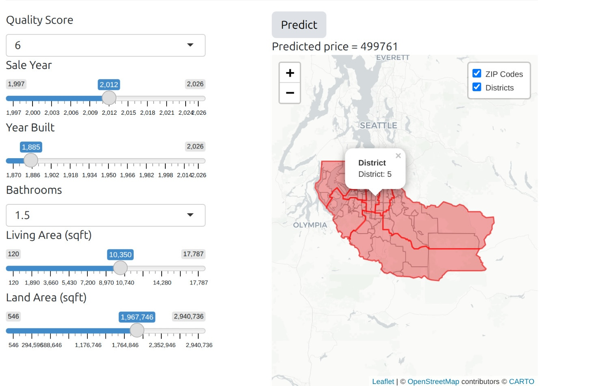

## Final Model

The final choice of model is the smaller LightGBM model, that uses only 7 input parameters. These parameters are required from the user:

-   sale year
-   quality score (1-10)
-   year built
-   building squarefeet
-   land squarefeet
-   longitude and latitude
-   number of bathrooms

## User Interface

The user interface includes a panel where the user can input the required parameters of the property of interest and a map that locates this property. On a press of a button, the user can obtain the sale price estimation.

