```{r}
#| include: false
knitr::opts_knit$set(root.dir = here::here())
options(scipen = 999)
```


## Data


---

## Data Cleaning

- columns with over 80% missing values were removed
- highly correlated columns were removed
- data tables were joined
- irrelevant columns (identifiers, one unique value, unique strings) were removed

At the end 63 candidate variables remained.

---

## EDA

### Focus: Sales Price (target variable)

---

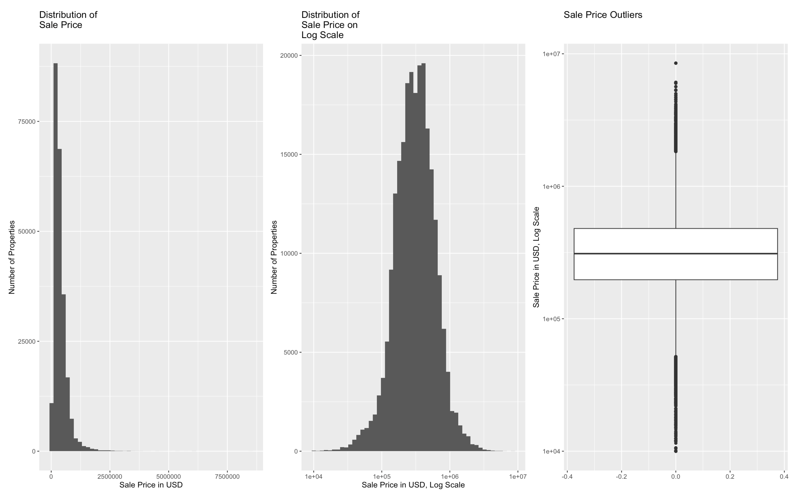


---

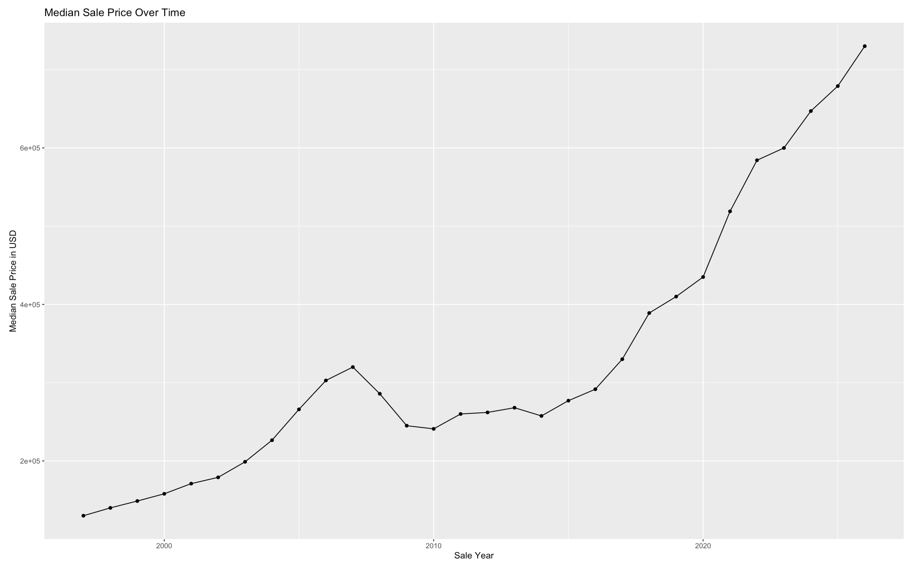

---

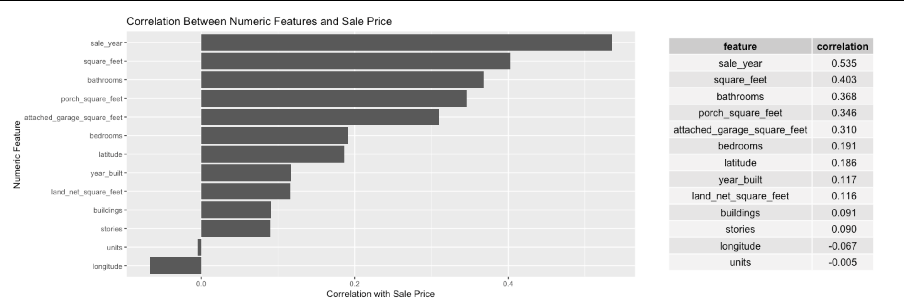

---

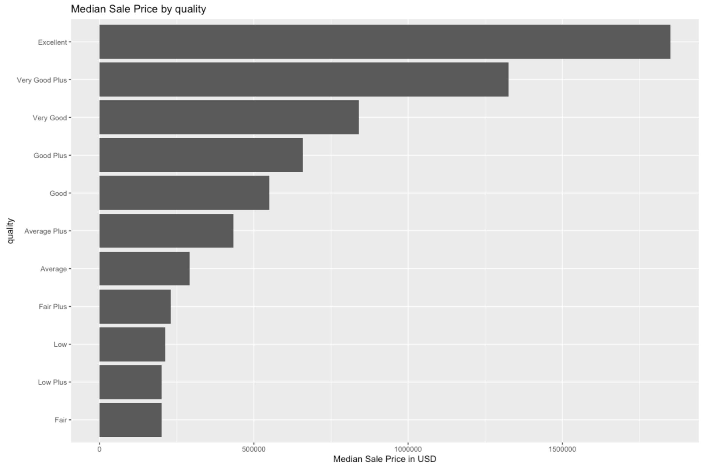

---

### Selected Variables and Interactions

---

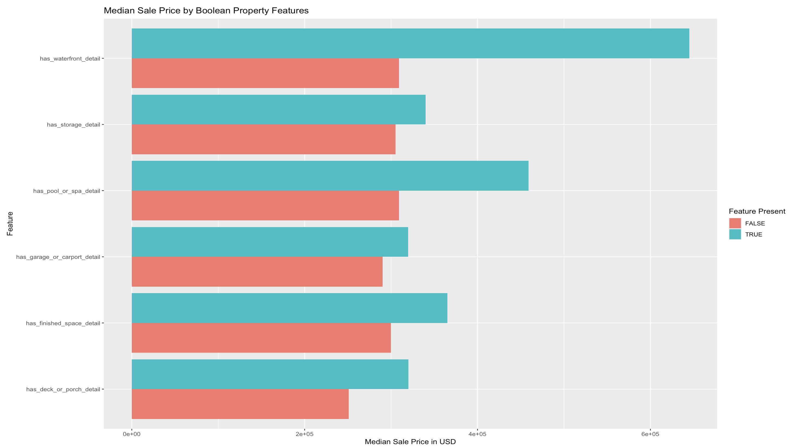

---

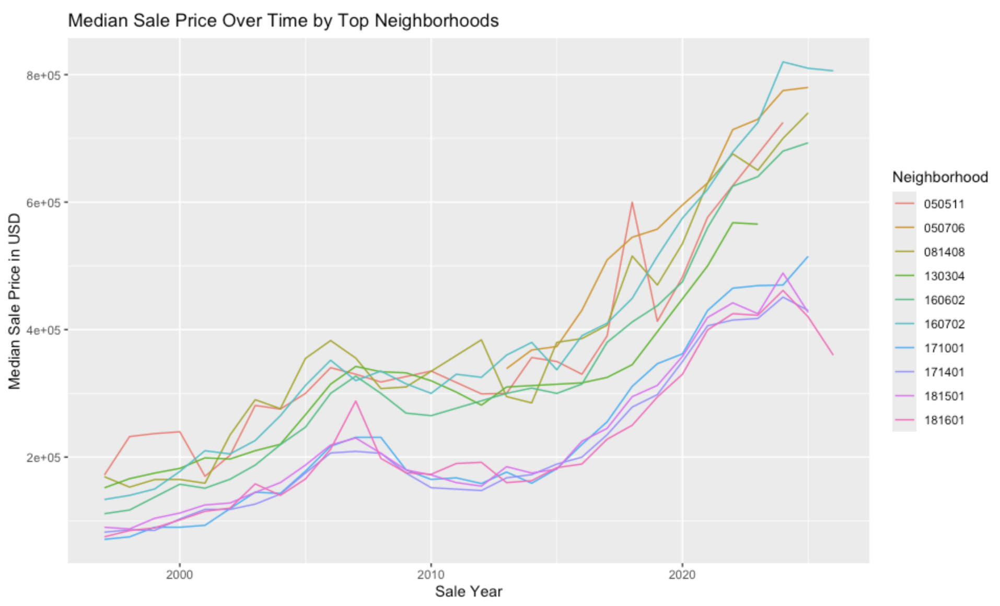

---

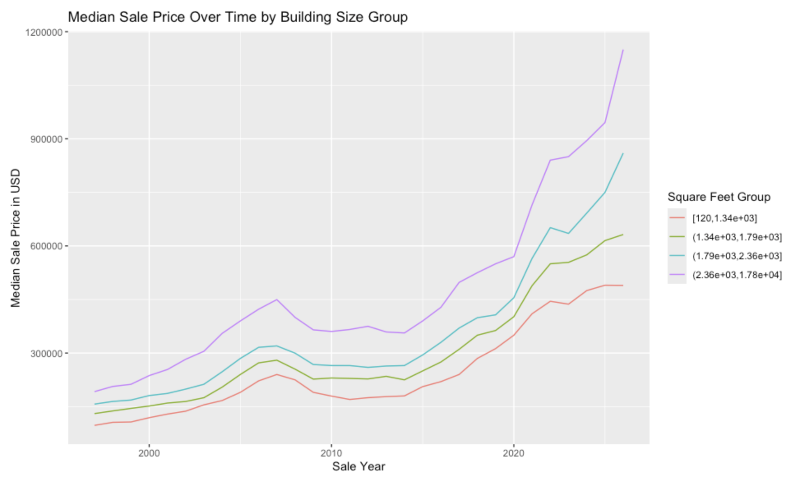

---

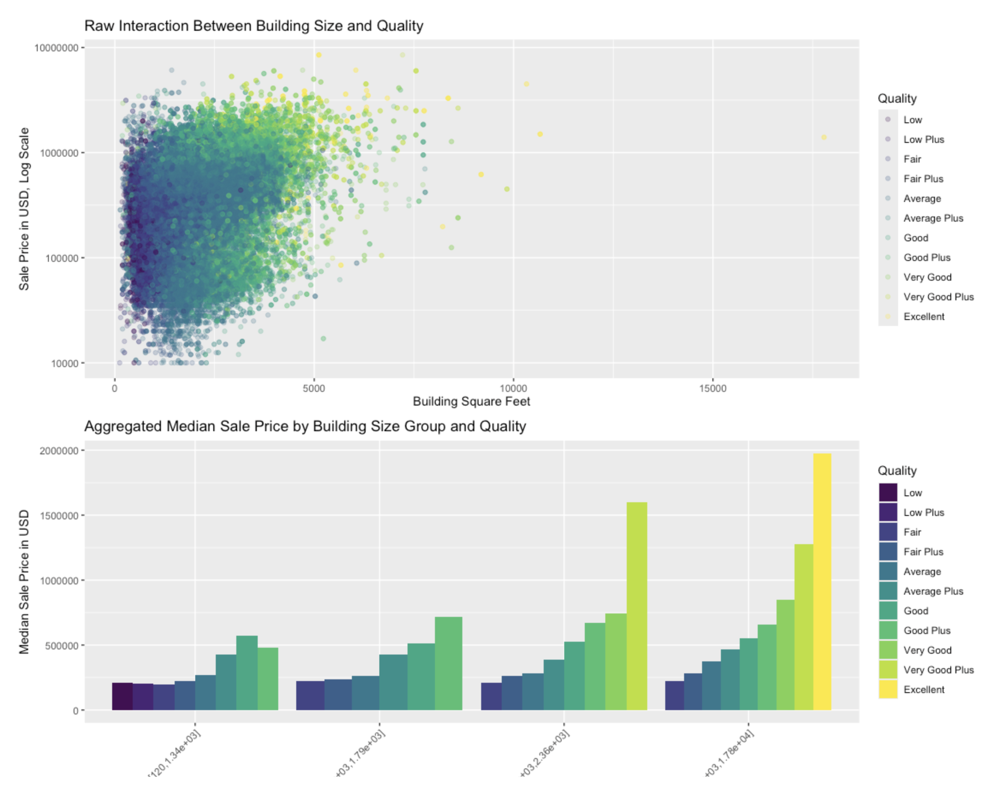

---

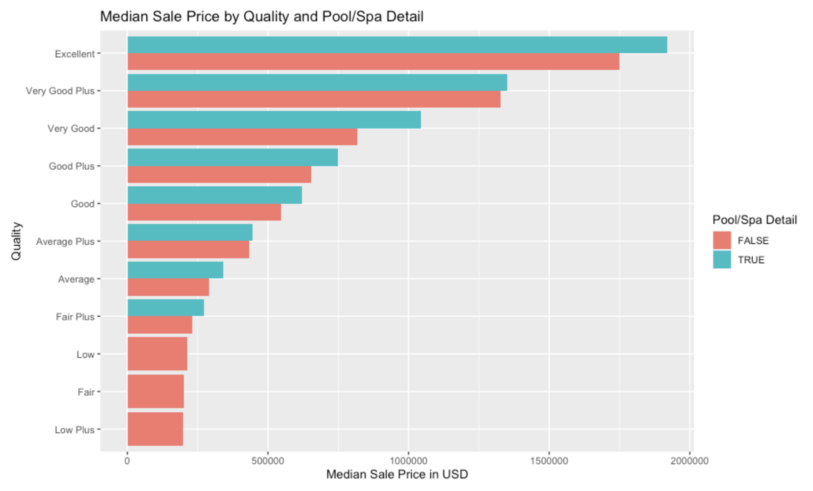

---

### Constructed Variables

---

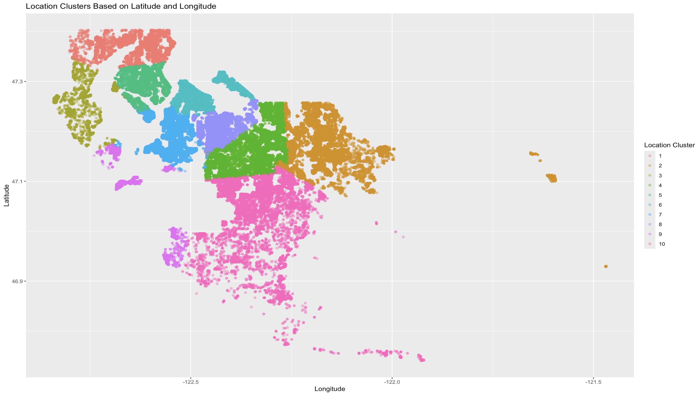

---

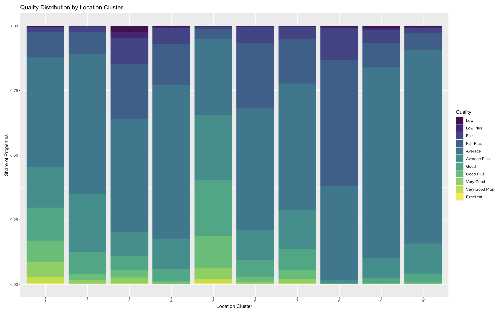

---

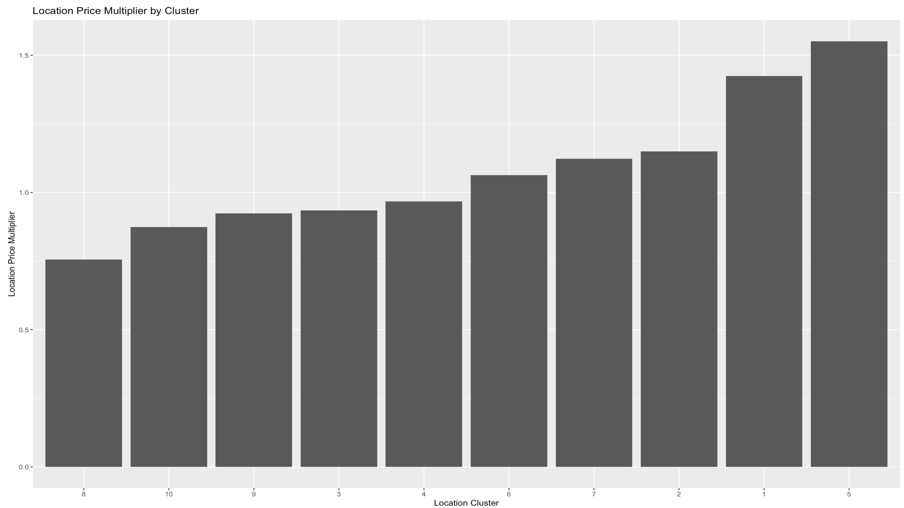

---

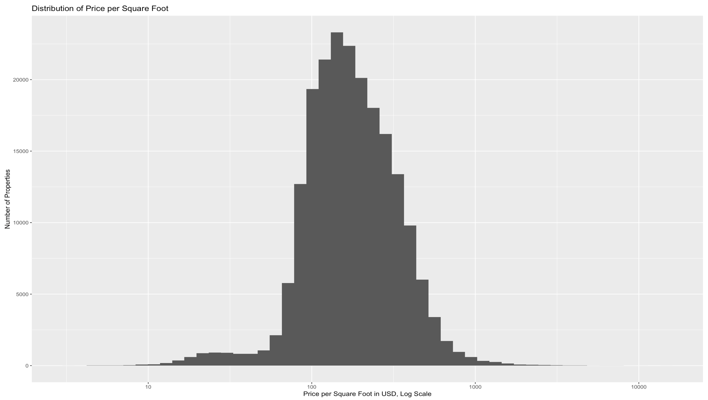

---


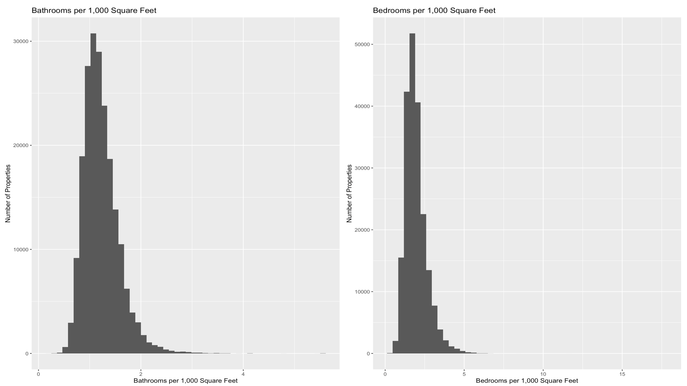

---

## Final Variable Selection {.scrollable}

::: {.smaller}
| App input | Used to create model features |
|-------------------------|-----------------------------------------------|
| Address or map location | `latitude`, `longitude`, `location_cluster` - will be derived |
| Sale year | `sale_year` |
| Living area | `square_feet` |
| Land size | `land_net_square_feet` |
| Porch/deck yes/no | `has_deck_or_porch_detail` |
| Porch/deck size | `porch_square_feet` |
| Garage yes/no | `has_garage_or_carport_detail` |
| Garage size | `attached_garage_square_feet` |
| Quality rating | `quality_score` |
| Number of bedrooms | `bedrooms`, `bedrooms_per_1000_sqft` - will be derived |
| Number of bathrooms | `bathrooms`, `bathrooms_per_1000_sqft` - will be derived |
| Year built | `year_built` |
| Pool/spa yes/no | `has_pool_or_spa_detail` |
| Waterfront yes/no | `has_waterfront_detail` |
| Finished extra space yes/no | `has_finished_space_detail` |
:::

---

## Competing models

1. Base Models
2. Linear Regression
3. KNN
4. LightGBM

---

## Base Model

---

The Baseline 1 model predicts the mean log sale price for all properties. Its performance is extremely poor. The RMSE of **315,683 USD** and MAE of **185,274 USD** indicate that the model cannot capture any meaningful variation in sale prices. The MAPE of 64.25% and the fact that only 17.86% of predictions fall within 15% of the true price further confirm that the naïve mean predictor is inadequate. This baseline serves as a lower bound for model performance: any useful predictive model must substantially outperform this benchmark.

---

The simple **linear regression** baseline performs substantially better than the naïve mean model, reducing RMSE from **315k USD to 226k USD** and increasing R² to 0.465. However, the model still leaves more than half of the variance unexplained and produces a MAPE of 33%, indicating that linear effects alone are insufficient to model residential sale prices. This confirms that house prices exhibit strong nonlinear and interaction effects, which require more flexible models such as gradient boosting.

---

**Ridge regression** improves over the simple linear baseline, increasing R² from **0.465 to 0.641** and **reducing RMSE by nearly 20,000 USD**. This confirms that multicollinearity is present in the dataset and that regularization stabilizes the model. However, the MAPE remains high at 33.7% and only 39% of predictions fall within 15% of the true price, indicating that linear models—even regularized ones—cannot capture the nonlinear and interaction-heavy structure of residential sale prices.

---

**LASSO regression** provides the strongest performance among all linear baselines, achieving an RMSE of **184,569 USD** and an R² of **0.682*. By shrinking weak coefficients to zero, LASSO performs implicit feature selection and reduces overfitting, which improves both RMSE and MAE compared to OLS and Ridge. However, the MAPE of 30.35% and the fact that only 44.6% of predictions fall within 15% of the true price indicate that linear models remain insufficient for capturing the nonlinear and interaction-heavy structure of residential sale prices. These results further justify the use of more flexible models.

---

**Elastic Net regression** provides the strongest performance among all linear baselines, achieving an RMSE of **185,218 USD** and an R² of **0.683**. By combining L1 and L2 penalties, Elastic Net balances feature selection and coefficient shrinkage, which improves stability and predictive accuracy. The model performs nearly identically to LASSO but slightly improves the percentage of predictions within 15% of the true price (44.97%). However, the MAPE of 30.36% and the fact that more than half of the variance remains unexplained indicate that linear models are insufficient for capturing the nonlinear and interaction‑heavy structure of residential sale prices.

---

## Linear Regression

---



---

## KNN

```{r}
#| include: false
metrics_table   <- readRDS(here::here("..", "..","analysis", "03-knn-files", "metrics_table.rds"))
within_15_table <- readRDS(here::here("..", "..","analysis", "03-knn-files", "within_15_table.rds"))
```

::: {style="font-size: 0.75em;"}
| Model | k | RMSE | R-squared | MAE |
|:----------|:-------|:-------|:-------|:-------|
| **minimal** | 5 | `r metrics_table[1, "RMSE"]` | `r metrics_table[1, "Rsquared"]` | `r metrics_table[1, "MAE"]` |
| **+sale_year** | 2 | `r metrics_table[2, "RMSE"]` | `r metrics_table[2, "Rsquared"]` | `r metrics_table[2, "MAE"]` |
| **+sale_year+quality** | 2 | `r metrics_table[3, "RMSE"]` | `r metrics_table[3, "Rsquared"]` | `r metrics_table[3, "MAE"]` |
| **full** | 2 | `r metrics_table[4, "RMSE"]` | `r metrics_table[4, "Rsquared"]` | `r metrics_table[4, "MAE"]` |

---

| Model | within 15% train | within 15% test |
|:----------|:-------|:-------|
| **minimal** | `r within_15_table[1, "within_15_train"]` | `r within_15_table[1, "within_15_test"]` |
| **+sale_year** | `r within_15_table[2, "within_15_train"]` | `r within_15_table[2, "within_15_test"]` |
| **+sale_year+quality** | `r within_15_table[3, "within_15_train"]` | `r within_15_table[3, "within_15_test"]` |
| **full** | `r within_15_table[4, "within_15_train"]` | `r within_15_table[4, "within_15_test"]` |
:::

---

## LightGBM

---

::: {style="font-size: 0.5em;"}
Two LightGBM feature-reduction models were compared to decide which model is more suitable for the final app.

| Model | Removed features | RMSE | MAE | R-squared | MAPE | Within 15% |
|-----------|-----------|----------:|----------:|----------:|----------:|----------:|
| Model that eliminates 3 features | `bedrooms`, `has_finished_space_detail`, `has_garage_or_carport_detail` | 88,896.91 | 41,668.10 | 0.9095 | 12.53% | 76.86% |
| Model that eliminates 7 features | `bedrooms_per_1000_sqft`, `bathrooms_per_1000_sqft`, `has_waterfront_detail`, `location_cluster`, `bedrooms`, `has_finished_space_detail`, `has_garage_or_carport_detail` | 90,574.49 | 42,210.63 | 0.9058 | 12.63% | 76.38% |
| Differences between models | Model with 7 removed features minus model with 3 removed features | +1,677.58 | +542.53 | -0.0037 | +0.10 % | -0.48 % |

:::

---

::: {style="font-size: 0.75em;"}
The model that eliminates 7 features has slightly weaker performance than the model that eliminates 3 features, but the difference is small. RMSE increases by 1,677.58 USD, MAE increases by 542.53 USD, MAPE increases by only 0.10 percentage points, and the percentage of predictions within 15 percent decreases by only 0.48 percentage points.

Because the model that eliminates 7 features removes 4 additional input variables while keeping very similar performance, it may be more suitable for the final app from a usability perspective.
:::

---

The final LightGBM model recommends using the following features: `sale_year`, `quality_score`, `year_built`, `square_feet`, `latitude`, `land_net_square_feet`, `bathrooms`, and `longitude`.

It suggests excluding `bedrooms_per_1000_sqft`, `bathrooms_per_1000_sqft`, `has_waterfront_detail`, `location_cluster`, `bedrooms`, `has_finished_space_detail`, and `has_garage_or_carport_detail`.


