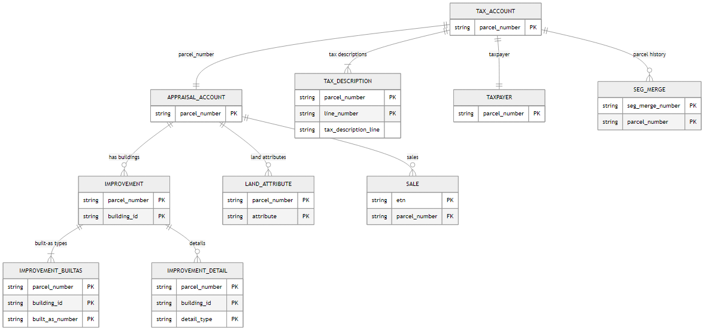

# Data Source Description & Data Dictionary

```{=html}
<style>
table {
  width: 100% !important;
}
table colgroup col:nth-child(1) {
  width: 25% !important;
}
table colgroup col:nth-child(2) {
  width: 10% !important;
}
table colgroup col:nth-child(3) {
  width: 10% !important;
}
table colgroup col:nth-child(4) {
  width: 45% !important;
}
table td:nth-child(4),
table th:nth-child(4) {
  width: 45% !important;
  word-wrap: break-word;
  overflow-wrap: break-word;
}
table td:nth-child(1),
table th:nth-child(1) {
  width: 25% !important;
}
table td:nth-child(2),
table th:nth-child(2) {
  width: 10% !important;
}
table td:nth-child(3),
table th:nth-child(3) {
  width: 10% !important;
}
</style>
```

## Overview

The Pierce County Assessor–Treasurer Data Mart is a comprehensive relational database containing detailed property assessment, taxation, appraisal, land-use, improvement, and sales transaction records maintained by Pierce County, Washington. The dataset integrates information from multiple administrative systems and organizes it into interconnected tables linked primarily through the parcel identification number, enabling consistent tracking of individual properties across taxation, valuation, ownership, and structural characteristics.

The database includes information related to property accounts, land attributes, building improvements, tax assessments, exemption categories, sales history, and geographic identifiers. Together, these tables provide a multidimensional representation of residential and commercial properties and support both fiscal administration and real-estate market analysis.

Here we provide a data dictionary with detailed descriptions of the available tables, attributes, data types, and relationships that form the foundation for exploratory data analysis, spatial analysis, and predictive modeling of residential property prices in Pierce County.

------------------------------------------------------------------------

## Relational Diagram

The data mart uses a relational schema with the following structure:

::: {.content-visible when-format="html"}

::: {#fig-pierce-er}

```{mermaid}
---
config:
  theme: 'neutral'
---
erDiagram

    TAX_ACCOUNT {
        string parcel_number PK
    }

    APPRAISAL_ACCOUNT {
        string parcel_number PK
    }

    IMPROVEMENT {
        string parcel_number PK
        string building_id PK
    }

    IMPROVEMENT_BUILTAS {
        string parcel_number PK
        string building_id PK
        string built_as_number PK
    }

    IMPROVEMENT_DETAIL {
        string parcel_number PK
        string building_id PK
        string detail_type PK
    }

    LAND_ATTRIBUTE {
        string parcel_number PK
        string attribute PK
    }

    TAX_DESCRIPTION {
        string parcel_number PK
        string line_number PK
        string tax_description_line
    }

    TAXPAYER {
        string parcel_number PK
    }

    SEG_MERGE {
        string seg_merge_number PK
        string parcel_number PK
    }

    SALE {
        string etn PK
        string parcel_number FK
    }

    %% Relationships

    TAX_ACCOUNT ||--|| APPRAISAL_ACCOUNT : "parcel_number"

    APPRAISAL_ACCOUNT ||--o{ IMPROVEMENT : "has buildings"

    IMPROVEMENT ||--|{ IMPROVEMENT_BUILTAS : "built-as types"

    IMPROVEMENT ||--o{ IMPROVEMENT_DETAIL : "details"

    APPRAISAL_ACCOUNT ||--o{ LAND_ATTRIBUTE : "land attributes"

    TAX_ACCOUNT ||--|{ TAX_DESCRIPTION : "tax descriptions"

    TAX_ACCOUNT ||--|| TAXPAYER : "taxpayer"

    TAX_ACCOUNT ||--o{ SEG_MERGE : "parcel history"

    APPRAISAL_ACCOUNT ||--o{ SALE : "sales"
```

Entity–relationship diagram of the Pierce County Assessor–Treasurer Data Mart showing the relationships among tax, appraisal, land, improvement, taxpayer, parcel history, and sales tables. The schema integrates information from both the Tax and Assessment System and the Appraisal System using the parcel number as the central linking key.

:::

:::

::: {.content-visible when-format="pdf"}

{#fig-pierce-er}

:::


::: {.content-visible when-format="pdf"}
### Key Architecture Summary

The Pierce County data uses a central **Parcel Number** as the primary identifier, with one Tax Account and one Appraisal Account per parcel. Each parcel can have multiple improvements (buildings), detailed land attributes, sales transactions, and segregation/merger records.

**Core Relationships**: - Tax Account → Appraisal Account (1:1 via Parcel Number) - Appraisal Account → Improvements (1:many via Parcel Number and Building ID) - Improvements → Built-As & Details (1:many via Building ID) - Parcels → Sales & Seg/Merge (1:many historical transactions)
:::

------------------------------------------------------------------------

::: {.content-visible when-format="pdf"}
## Data Dictionary Summary

The data mart contains nine related tables. A brief summary follows:

1.  **Tax Account**: Current tax and assessment information per parcel
2.  **Appraisal Account**: Detailed property appraisal with characteristics
3.  **Improvement**: Building-level details (multiple per parcel)
4.  **Improvement Built-As**: Construction specifications and year built
5.  **Improvement Detail**: Features (garages, decks, fireplaces, etc.)
6.  **Land Attribute**: Land-specific characteristics affecting valuation
7.  **Sale**: Historical property sales transactions
8.  **Seg/Merge**: Property segregation and merger history
9.  **Taxpayer**: Owner information (privacy restricted)

For detailed field definitions, see the appendix.
:::

::::: {.content-visible when-format="html"}
## Table Definitions

:::: panel-tabset
### Tax Account

Tracks current tax and assessment account information for each property.

| Field Name | Type | Size | Description |
|-----------------------|---------|---------|-------------------------------------------|
| **Parcel Number** | Text | 10 | Unique 10 digit number assigned to each property |
| Account Type | Text | 5 | REAL - Real Property; STRUC - Structures; PERS - Personal Property; MOBIL - Mobile Home |
| Property Type | Text | 5 | ASIMP - Administrative Seg Improvement; LNDIM - Land and Improvements; MBLHM - Mobile Home; RRLEA - Railroad Leases; SAPP - State Assessed Personal Property; SARP - State Assessed Real Property; STRUC - Leased Land and/or Structure |
| Site Address | Text | 50 | Physical location address of the property. May be different than mailing address. "XXX" indicates estimated address using GIS |
| Use Code | Text | 5 | 4-digit numeric code for present highest and best use of the property |
| Use Description | Text | 50 | Text description of the numeric use code |
| Tax Year - Prior | Integer |  | Tax year for which all prior year values apply |
| Tax Code Area - Prior Year | Text | 10 | Code describing geographical area and specific combination of taxing districts. Subject to annual change |
| Exemption Type - Prior Year | Text | 40 | Type of exemption, if any, applied to the property |
| Current Use Code - Prior Year | Text | 5 | AGRI - Agricultural; CT - Current Use Timber; FORDG - Forest Designated; OPBRS - Open Space PBRS; OPEN - Open Space |
| Land Value - Prior Year | Integer |  | Total fair market value of land, as determined by appraisal process |
| Improvement Value - Prior Year | Integer |  | Total fair market value of improvements (buildings, structures), as determined by appraisal process |
| Total Market Value - Prior Year | Integer |  | Total fair market value of land and improvements, as determined by appraisal process |
| Taxable Value - Prior Year | Integer |  | Market value of the property, minus any exemptions granted |
| Tax Year - Current | Integer |  | Tax year for which all current year values apply |
| Tax Code Area - Current Year | Text | 10 | Code describing geographical area and specific combination of taxing districts |
| Exemption Type - Current Year | Text | 40 | Type of exemption, if any, applied to the property |
| Current Use Code - Current Year | Text | 5 | AGRI - Agricultural; CT - Current Use Timber; FORDG - Forest Designated; OPBRS - Open Space PBRS; OPEN - Open Space |
| Land Value - Current Year | Integer |  | Total fair market value of land for the parcel |
| Improvement Value - Current Year | Integer |  | Total fair market value of improvements (buildings, structures) for the parcel |
| Total Market Value - Current Year | Integer |  | Total fair market value of land and improvements for the parcel |
| Taxable Value - Current Year | Integer |  | Market value of the property, minus any exemptions granted |
| Range | Text | 10 | Range |
| Township | Text | 10 | Township |
| Section | Text | 20 | Section |
| Quarter Section | Text | 20 | Quarter |
| Subdivision Name | Text | 50 | Subdivision name |
| Located On Parcel | Text | 10 | Real property parcel number on which this improvement-only parcel is located (Personal Property, Mobile Homes, Leasehold Structures) |

: Pierce County data dictionary - field definitions and descriptions for all tables. {#tbl-data-dictionary}

### Appraisal Account

Detailed property appraisal data with characteristics and valuations.

| Field Name | Type | Size | Description |
|-----------------------|---------|---------|-------------------------------------------|
| **Parcel Number** | Text | 10 | Unique 10 digit number assigned to each property |
| Appraisal Account Type | Text | 15 | Com Condo, Com Leasehold, Com Multi Unit, Commercial, Industrial, Mobile Home, Reference, Res Com Condo, Res Leasehold, Residential, Trended Invest |
| Business Name | Text | 50 | Main business name on the parcel, or space number for mobile/manufactured home in a park |
| Value Area ID | Text | 10 | Identifies the Physical Inspection cycle for each parcel (PI1 to PI6) |
| Land Economic Area | Text | 30 | Also known as LEA, ties parcels to land valuation models. For Commercial: identifies land use model by PI year. For Residential: location code identifying appraisal area, sector and subsector. For Res Com Condos: relates directly to account land value |
| Buildings | Integer |  | Represents the number of improvements (buildings) located on a parcel |
| Group Account Number | Text | 30 | Identifies and ties all parcels qualifying as one economic unit (contiguous assessment). Also identifies all parcels in a condominium project |
| Land Gross Acres | Decimal | 15.4 | Total acres that make up the economic unit which could include multiple parcels |
| Land Net Acres | Decimal | 15.4 | Size of the individual parcel in acres |
| Land Gross Square Feet | Decimal | 15.4 | Total square feet that make up the economic unit which could include multiple parcels |
| Land Net Square Feet | Decimal | 15.4 | Size of the individual parcel in square feet |
| Land Gross Front Feet | Decimal | 15.4 | For commercial parcels: front feet of the site facing the arterial. For residential: front feet of the lot facing the address side. For waterfront: effective waterfront length of individual lot or combination of lots under single ownership |
| Land Width | Integer |  | Residential Use Only. Equal to the Net Effective Waterfront Front Feet of the individual parcel, or using Group Account allocation method, then the sum of Net Effective Waterfront Front Feet for the group |
| Land Depth | Integer |  | Residential Use Only. Equal to the Net Effective Depth of the individual waterfront parcel, or using Group Account allocation method, then the sum of Net Effective Depths for the waterfront group. Measured from the top of the bank (where bulkhead begins) to the inland property line |
| Submerged Area Square Feet | Integer |  | Area of a parcel that is submerged. Not included in the Gross or Net Square Feet |
| Appraisal Date | Date |  | Indicates the most recent date an appraiser physically observed the property and/or made changes to the record |
| Waterfront Type | Text | 30 | Describes the type of waterfront the property adjoins or has legal access to |
| View Quality | Text | 30 | Assigned to reflect the market appeal of the overall view available from the dwelling or property |
| Utility Electric | Text | 30 | Identifies if power is installed, available or is not available on the property |
| Utility Sewer | Text | 30 | Identifies if sewer/septic is installed, available or not available if the property does not support an on site sewage disposal system (no perc) |
| Utility Water | Text | 30 | Identifies if water is installed, available or is not available |
| Street Type | Text | 30 | Identifies if the access street is paved or unpaved. If blank, the parcel could be a reference parcel or a mobile home assessed as personal property |
| Latitude | Decimal | 10.5 | The latitude of the parcel centroid. Some parcels may not have latitude/longitude coordinates (building-only, mineral rights and reference parcels, as well as others not represented in the GIS system) |
| Longitude | Decimal | 10.5 | The longitude of the parcel centroid |

### Improvement

Detailed building improvement data linked to appraisal accounts.

| Field Name | Type | Size | Description |
|-----------------------|---------|---------|-------------------------------------------|
| **Parcel Number** | Text | 10 | Unique 10 digit number assigned to each property |
| **Building ID** | Text | 5 | Unique identifier for each improvement record on a parcel. Not all improvements are on a separate record and may not always be in sequence |
| Property Type | Text | 15 | Links buildings to proper cost and depreciation tables. Options include: Commercial, Duplex, Industrial, Mobile Home, Multiple Unit, Out Building, Residential, Townhouse, Triplex |
| Neighborhood | Text | 10 | Represents boundaries for land subject to similar social, environmental, economic and governmental forces. Boundaries are typically located within a geographic area defined by natural, man-made, or political boundaries. Residential Neighborhoods and LEA's are the same. Commercial Neighborhoods define the location of the property while Commercial LEA's define the use of the property |
| Neighborhood Extension | Text | 10 | Based on property type: Commercial - represents the primary occupancy or use of the property. Residential - not used, therefore they are set to zero. Mobile/Manufactured Homes - based upon the underlying land ownership. All Mobile/Manufactured homes located on land owned by the Mobile/Manufactured home owner are coded with the Neighborhood Extension 0. Exception - Mobile/Manufactured homes located within a park and owned by the park owner, will carry the same Neighborhood Extension as the park. Mobile Homes in a park have a neighborhood extension of: PL 1 (P = Park, L = Leased); P2, P3, P4, etc |
| Square Feet | Integer |  | Sum of the square feet for the 'built as' types identified for the building. Each building may have one or more 'built as' type (see IMPROVEMENT BUILTAS table), though usually only one. The exceptions are 'built as' \# 124 and 126 (Add on only Res & Com) or any type of Storage Tank, where it represents the count of those 'built as' as opposed to the sum of their square feet |
| Net Square Feet | Integer |  | Used primarily to calculate income on commercial properties, where it typically represents the sum of the net rentable area(s). This number may be representative of one or more buildings. If part of a Group Account, these buildings may be located on more than one parcel. For Residential it is equal to the built as square feet or zero (0) |

### Improvement Built-As

Detailed specifications for building construction styles and features.

| Field Name | Type | Size | Description |
|-----------------------|---------|---------|-------------------------------------------|
| **Parcel Number** | Text | 10 | Unique 10 digit number assigned to each property |
| **Building ID** | Text | 5 | Unique identifier for each improvement record on a parcel |
| **Built-As Number** | Integer |  | Unique number identifying each Built-As on an improvement. Sequential number assigned by the system starting with the largest Built-As being number 1 |
| Built-As ID | Integer |  | Number associated with the description of the purpose or style of construction of the building |
| Built-As Description | Text | 255 | Original purpose for and/or style of construction of the building. The Built As is associated with the Marshall and Swift cost and depreciation tables |
| Built-As Square Feet | Integer |  | Sum of the square feet for the 'built as' types identified for the building. Each building may have one or more 'built as' type, though usually only one. The exceptions are 'built as' \# 124 and 126 (Add on only Res & Com) or any type of Storage Tank |
| HVAC | Integer |  | Code associated with the predominant heating source for the built-as structure |
| HVAC Description | Text | 30 | Text description associated with the predominant heating source for the built-as structure (Forced Air, Electric Baseboard, Steam, etc) |
| Exterior | Text | 25 | Predominant type of construction materials used for the exterior siding on Residential Buildings |
| Interior | Text | 15 | Predominant type of materials used on the interior walls (Sheetrock or Paneling). Collected for Residential and Mobile Homes only |
| Stories | Decimal | 13.2 | Number of floors/building levels above grade. Stories do not include attic or basement areas |
| Story Height | Integer |  | Based on property type: Commercial - determined by taking an average of the overall ceiling heights of all floors for the Blt As. Residential - determined by the majority of the story height for the first floor (main). Story height is automatically rounded by the system (The system rounds up for .5 and higher and rounds down for anything below .5) |
| Sprinkler Square Feet | Integer |  | Total square footage covered by a sprinkler system. Sprinkler SF does not always equal the built as square footage |
| Roof Cover | Text | 20 | Material used for the roof (Composition Shingles, Wood Shake, Concrete Tile, etc) |
| Bedrooms | Integer |  | Number of bedrooms listed for a residential property (Collected for informational purposes only) |
| Bathrooms | Decimal | 7.2 | Number of baths listed for a residential property. The number is listed as a decimal, i.e. 2.75 = two full and one three-quarter baths. A tub/sink/toilet combination (plus any additional fixtures) is considered 1.0 bath. A shower/sink/toilet combination (plus any additional fixtures) is 0.75 bath. A sink/toilet combination is .5 bath |
| Units | Integer |  | Number of separate units within the building. For Commercial properties, Units may be combined to generate an income approach for the economic unit on building one |
| Class Code | Text | 20 | Code for one of five basic cost groups by type of framing (supporting beams and columns), walls, floors and roof structures, and fireproofing. Typically Commercial Buildings |
| Class Description | Text | 50 | Text description for one of five basic cost groups by type of framing (supporting beams and columns), walls, floors and roof structures, and fireproofing. Typically Commercial Buildings |
| Year Built | Integer |  | Year the building was built, as stated by the building permit or a historical record |
| Year Remodeled | Integer |  | Year in which improvements are made to the existing structure that extend the life of the structure |
| Adjusted Year Built | Integer |  | If greater than the Year Built, it indicates improvements have been made to the original property over and above normal maintenance which would effectively reduce the age of the building |
| Physical Age | Integer |  | Tax year less the adjusted year built equals the physical age of the built as |
| Built-As Length | Integer |  | Length of the mobile/manufactured home |
| Built-As Width | Integer |  | Width of the mobile/manufactured home |
| Mobile Home Model | Text | 50 | Model of the mobile/manufactured home |

### Improvement Detail

Additional specific improvement characteristics and features.

| Field Name | Type | Size | Description |
|-----------------------|---------|---------|-------------------------------------------|
| **Parcel Number** | Text | 10 | Unique 10 digit number assigned to each property |
| **Building ID** | Text | 5 | Unique identifier for each improvement record on a parcel |
| **Detail Type** | Text | 10 | Category that specific improvement characteristics are coded under. Options include: Add On, Appliance, Balcony, Basement, Carport, Elevator, Fixture, Garage, Mezzanine, Porch, Rough In, Storage. The Add On type allows the appraiser to assign a quality different from the main structure for the characteristics within this field |
| Detail Description | Text | 50 | Brief explanation of the improvement characteristic (Fireplace, PreFab/Stoves, Laundry Facility, Type of Porch (Cvrd Wd Deck), Type of Bath (Bath 2 Fixture)) |
| Units | Decimal | 15.4 | Component parts of the building characteristics. The units indicate either the square footage of the structure or a count of each component. Examples: Appliance, Allowance, 1 (count) or Porch, Open Slab, 337 (sf), or Fixture – Bath 3 Fixtures – 2 (count) |

### Land Attribute

Land-specific attributes and characteristics affecting valuation.

| Field Name | Type | Size | Description |
|-----------------------|---------|---------|-------------------------------------------|
| **Parcel Number** | Text | 10 | Unique 10 digit number assigned to each property |
| **Attribute** | Text | 30 | Describes the category that a land attribute is assigned to: Residential (R), Commercial (C) or Res Com Condo (X) and the subcategory, such as Amenities, Economic, Functional, Neighborhood, Utilities, etc |
| Attribute Description | Text | 30 | Further defines the land attribute. Land attributes may or may not contribute to value (Examples of attributes: View Avg, NBHD Gated, WF Bank Low, water available etc) |

### Sale

Historical property sales transaction data.

| Field Name | Type | Size | Description |
|-----------------------|---------|---------|-------------------------------------------|
| **ETN** | Text | 11 | Recording number issued by the Auditor's Office when a property transaction is recorded. Excise tax must be paid before the document of conveyance can be recorded or the mobile home title transferred |
| Parcel Count | Integer |  | Number of parcels associated with a sale |
| Parcel Number | Text | 10 | Unique 10 digit number assigned to each property |
| Sale Date | Date |  | Date the legal document (deed) was executed |
| Sale Price | Decimal | 15.2 | Dollar amount recorded on the ETN |
| Deed Type | Text | 40 | Type of document which conveyed an interest in or legal title to the property |
| Grantor | Text | 80 | Individual(s) or company conveying ownership or interest in the property described on the deed |
| Grantee | Text | 80 | Individual(s) or company purchasing ownership or interest in the property described on the deed |
| Valid/Invalid | Text | 7 | Used to code the validity of a sale for appraisal purposes. A sale in the open market between two unrelated parties, each of whom is reasonably knowledgeable of market conditions and under no undue pressure to buy or sell would be considered a valid transaction. However, a sale can be a valid transaction but if the conditions of the sale fit one of the 27 deletion categories identified in the State Ratio RCW, the sale would be coded invalid for Assessor purposes (sale between relatives, estate sale, percent interest, etc) |
| Confirmed/Unconfirmed | Text | 11 | Identifies if the property characteristics at the time of the sale and/or circumstances of the sale were verified by Assessor-Treasurer staff |
| Exclude Reason | Text | 30 | State required description of why a sales transaction must be excluded from sales studies. Examples include non-arms length sales transactions such as "Family different last names", sale transactions with undue pressure such as "Estate sale" and "Forced Sale Trans in Lieu Fcl", and sales where the property characteristics have changed since the sale, "Improved after sale" |
| Improved/Vacant | Text | 8 | If any parcel in the sale has any building value it is coded as improved. Vacant is vacant land with no building value |
| Appraisal Account Type | Text | 15 | How a parcel is classified (Com Condo, Com Leasehold, Com Multi Unit, Commercial, Industrial, Mobile Home, Reference, Res Com Condo, Res Leasehold, Residential, Trended Invest) |

### Seg/Merge

Property segregation and merger transaction history.

| Field Name | Type | Size | Description |
|-----------------------|---------|---------|-------------------------------------------|
| **Seg/Merge Number** | Text | 12 | Unique number assigned to each segregation |
| Parent/Child Indicator | Text | 1 | P - Parent Parcel - inactivated parcel being replaced by the new child parcel. There may be zero, one or more parent parcels involved with each segregation. In some cases, a parent parcel may remain active after the segregation. C - Child Parcel - a new parcel created as a result of the seg. There are one or more child(ren) parcels involved with each segregation |
| **Parcel Number** | Text | 10 | Unique 10 digit number assigned to each property |
| Continued Indicator | Text | 1 | Y - the parcel is still active after the segregation; N - the parcel is no longer active after the segregation |
| Completed Date | Date |  | Date that the segregation was completed |
| Tax Year | Text | 4 | Tax year of the segregation |

### Taxpayer

Property owner information (subject to privacy restrictions).

| Field Name | Type | Size | Description |
|-----------------------|---------|---------|-------------------------------------------|
| **Parcel Number** | Text | 10 | Unique 10 digit number assigned to each property |


### Tax Description

Detailed tax coding and descriptions for parcels.

| Field Name | Type | Size | Description |
|-----------------------|---------|---------|-------------------------------------------|
| **Parcel Number** | Text | 10 | Unique 10 digit number assigned to each property |
| **Line Number** | Integer |  | Sequential number identifying each line of a tax description |
| Tax Description Line | Text | 200 | Tax description text |
::::
:::::
