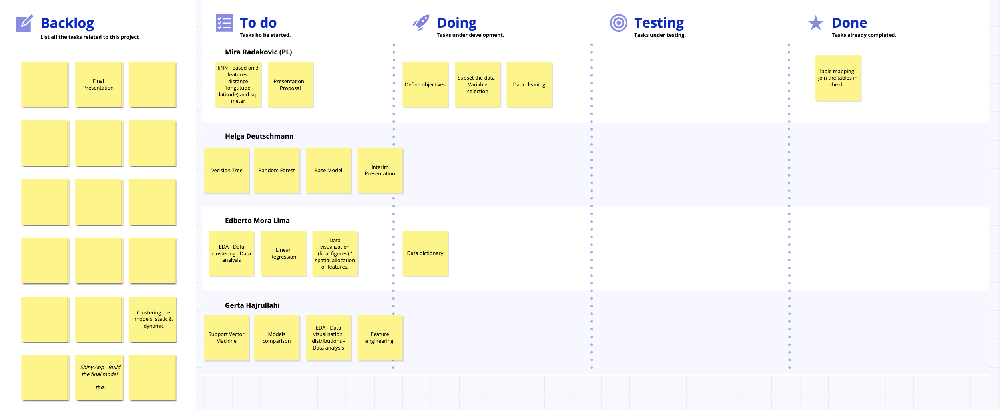

# Project Organization & Task Allocation

## Group Structure

| Name                    | Role           |
|:------------------------|:---------------|
| **Mira Radakovic (PL)** | Project Leader |
| **Edberto Moura Lima**  | Data Analyst   |
| **Gerta Hajrullahi**    | Data Analyst   |
| **Helga Deutschmann**   | Data Analyst   |

## Tools & Infrastructure

| Component              | Detail                                      |
|------------------------|---------------------------------------------|
| **Language**           | R (primary)                                 |
| **Database**           | Supabase (PostgreSQL)                       |
| **Version Control**    | Git + GitHub                                |
| **Project Management** | GitHub Projects (Kanban Board)              |
| **Communication**      | Group messaging + sync meetings             |
| **Documentation**      | Quarto                                      |
| **Data Wrangling**     | dplyr, tidyr, readr                         |
| **EDA & Viz**          | ggplot2, corrplot, leaflet, plotly          |
| **Modelling**          | caret / tidymodels, ranger, xgboost, glmnet |
| **Spatial Analysis**   | sf, geosphere                               |
| **Deployment**         | Shiny, shinydashboard                       |

## Project Kanban Board

The following board tracks the real-time status of all project tasks.

## Risk Management

| Risk | Mitigation |
|------------------------------------|------------------------------------|
| Large number of tables / complex joins | Build join pipeline incrementally; validate row counts at each step |
| Many missing values in building details | Imputation strategies (median/mode); sensitivity analysis on imputed variables |
| Data covers multiple property types (commercial, mobile homes) | Filter to Residential Improved sales only at ingestion |
| Temporal drift in prices (market cycles) | Include sale year/month as features; optionally restrict to recent years |
| Skewed Sale Price distribution | Log-transform target; evaluate models on both scales |
| Shiny App complexity | Start with minimal viable app; add features iteratively |