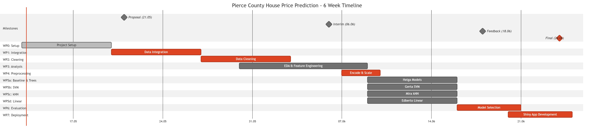

# Project Schedule & Work Packages

**Project Duration**: 13 May – 24 June 2026 (6 weeks)

------------------------------------------------------------------------

## Interactive Gantt Chart

The following chart outlines the project timeline, milestones, and critical path.

```{mermaid}
gantt
    title House Price Prediction Timeline
    dateFormat YYYY-MM-DD
    axisFormat %d-%m

    section Milestones
    Proposal Submission (21.05) :milestone, m1, 2026-05-21, 0d
    Interim Results (06.06)    :milestone, m2, 2026-06-06, 0d
    Final Submission (24.06)   :crit, milestone, m4, 2026-06-24, 0d

    section Phases
    Project Setup      :done, wp0, 2026-05-13, 7d
    Data Integration   :crit, wp1, 2026-05-20, 7d
    Data Cleaning      :crit, wp2, 2026-05-27, 7d
    EDA & Features     :wp3, 2026-05-30, 10d
    Preprocessing      :crit, wp4, 2026-06-07, 3d
    Model Development  :wp5, 2026-06-09, 7d
    Model Evaluation   :crit, wp6, 2026-06-16, 5d
    Deployment         :crit, wp7, 2026-06-20, 5d
```

::: {.content-visible when-format="pdf"}
{#fig-gantt-static}
:::

------------------------------------------------------------------------

## Detailed Work Package Definitions

### WP0: Project Setup

**Duration**: 13–19 May \| **Status**: Done

#### Tasks

- Define team roles and responsibilities
- Create Git repository (private, shared with lecturer)
- Set up Supabase database connection
- Initialize Kanban board (Backlog/To Do/Doing/Testing/Done)
- Configure R development environment

#### Deliverables

✓ GitHub repository ✓ Supabase connection ✓ Kanban board ✓ Team charter document

------------------------------------------------------------------------

### WP1: Data Integration

**Duration**: 20–26 May \| **Status**: To Do

#### Tasks

1.  Download Pierce County data files
2.  Map table relationships and join keys
3.  Perform sequential table joins (validate at each step)
4.  Validate referential integrity and row counts
5.  Create data integration report

#### Deliverables

- Integrated dataset (.RData)
- Table mapping diagram
- Data dictionary (updated)
- Validation report with row counts

#### Quality Criteria

- [ ] All tables joined successfully
- [ ] Row counts documented at each step
- [ ] No unexpected NULL values
- [ ] Referential integrity verified

------------------------------------------------------------------------

### WP2: Data Cleaning & Preparation

**Duration**: 27 May – 2 June \| **Status**: To Do

#### Tasks

1.  Filter to Residential Improved properties only
2.  Remove duplicate records
3.  Handle missing values (document strategy)
4.  Examine and document outliers
5.  Variable selection — keep only analysis-ready columns
6.  Run validation test suite

#### Deliverables

- Cleaned dataset (.RData)
- Data cleaning log
- Missing value analysis
- Quality assurance report

#### Quality Criteria

- [ ] No critical missing values
- [ ] Data types verified
- [ ] Outliers documented
- [ ] Test suite passes

------------------------------------------------------------------------

### WP3: Exploratory Data Analysis & Feature Engineering

**Duration**: 30 May – 9 June \| **Status**: To Do

#### WP3a: EDA Tasks

- Univariate analysis (distributions, summaries)
- Bivariate analysis (price vs. key variables)
- Spatial analysis with leaflet maps
- Correlation matrix and hypothesis testing

#### WP3b: Feature Engineering Tasks

- Create derived features (age, price/sqft, neighborhood effects, etc.)
- Encode categorical variables
- Feature selection — target ≥15 final features
- Document feature importance baseline

#### Deliverables

- EDA report with visualizations
- Correlation heatmap
- Feature engineering log
- Final feature set documentation (≥15 features)

#### Quality Criteria

- [ ] All visualizations publication-ready
- [ ] ≥15 features engineered and named
- [ ] No data leakage from target variable
- [ ] Feature-target correlations documented

------------------------------------------------------------------------

### WP4: Preprocessing

**Duration**: 7–9 June \| **Status**: To Do

#### Tasks

1.  Encode categorical variables (finalize encoding scheme)
2.  Scale numerical variables (standardize or normalize)
3.  Train/validation/test split (70/15/15% stratified)
4.  Document random seed for reproducibility

#### Deliverables

- 3 split datasets (train, validation, test)
- Encoding mapping tables
- Scaling parameters (saved as R object)
- Data split documentation

#### Quality Criteria

- [ ] No data leakage (scaling only from training set)
- [ ] Balanced distribution across splits
- [ ] Random seed documented
- [ ] All features properly encoded/scaled

------------------------------------------------------------------------

### WP5: Model Development (Parallel Tracks)

**Duration**: 9–15 June \| **Status**: To Do

#### WP5a: Baseline & Tree Models

- Baseline Linear Regression
- Decision Tree (hyperparameter tuning)
- Random Forest (grid search over parameters)

#### WP5b: Support Vector Machine

- SVM setup (kernel selection)
- Hyperparameter tuning (C, epsilon)
- Cross-validation

#### WP5c: k-Nearest Neighbours

- Setup (distance metric, k selection)
- kNN based on: distance (lon, lat) + square metre
- Hyperparameter optimization

#### WP5d: Linear Regression

- Full feature set training
- Feature importance extraction
- Residual diagnostics

#### Deliverables

- Trained model objects (.RDS)
- Cross-validation results
- Validation & test metrics
- Model configuration documentation

#### Quality Criteria

- [ ] All 5 models trained and saved
- [ ] Cross-validation RMSE \< 100k (preliminary)
- [ ] No data leakage to validation/test
- [ ] Test predictions generated for all samples

------------------------------------------------------------------------

### WP6: Model Evaluation & Selection

**Duration**: 16–20 June \| **Status**: To Do

#### Tasks

1.  Cross-validation for all 5 models (k=5 fold)
2.  Performance benchmarking (RMSE, MAE, R²)
3.  Create model comparison table and visualizations
4.  Select best model based on criteria:
    - RMSE \< USD 80,000
    - R² \> 0.80
5.  Extract and visualize feature importance

#### Deliverables

- Model comparison table (CSV)
- Benchmarking plots (PNG/PDF)
- Best model selection report
- Feature importance ranking
- Final model object saved

#### Quality Criteria

- [ ] All models evaluated on same test set
- [ ] Best model meets RMSE \< 80k & R² \> 0.80 targets
- [ ] Feature importance interpreted
- [ ] Selection criteria documented

------------------------------------------------------------------------

### WP7: Deployment & Documentation

**Duration**: 20–24 June \| **Status**: To Do

#### Tasks

1.  Build Shiny App (UI + server logic)
2.  Create prediction endpoint (returns estimate + confidence interval)
3.  Add feature importance visualization
4.  Final validation testing
5.  Prepare presentation slides
6.  Assemble final report
7.  Deploy to shinyapps.io or local server

#### Deliverables

- Deployed Shiny App
- App source code (app.R)
- Presentation slides (PDF)
- Final report (PDF)
- User guide & model documentation
- All code on GitHub

#### Quality Criteria

- [ ] Shiny App loads without errors
- [ ] Predictions return in \<5 seconds
- [ ] Confidence intervals displayed
- [ ] Presentation covers all key findings
- [ ] Report submitted via Moodle by deadline

------------------------------------------------------------------------

## Dependencies & Critical Path

| WP  | Depends On | Notes                              |
|-----|------------|------------------------------------|
| WP1 | WP0        | Requires Git repo & Supabase setup |
| WP2 | WP1        | Requires integrated dataset        |
| WP3 | WP2        | Requires clean dataset             |
| WP4 | WP3        | Requires feature set               |
| WP5 | WP4        | Requires preprocessed data         |
| WP6 | WP5        | Requires all trained models        |
| WP7 | WP6        | Requires selected best model       |

**Critical Path Tasks**: 1. WP1: Data integration (26.05) 2. WP2: Data cleaning (02.06) 3. WP3: Feature engineering (09.06) 4. WP4: Train/test split (09.06) 5. WP5: Model training (15.06) 6. WP6: Model selection (20.06) 7. WP7: Shiny App deployment (23.06)

------------------------------------------------------------------------

## Key Milestones

| Date | Event | Deliverables |
|------------------------|------------------------|------------------------|
| **21.05.2026** | Proposal Presentation | Objectives, data dictionary, organization, development plan |
| **06.06.2026** | Interim Results | Data status, EDA findings, initial model results |
| **18.06.2026** | Feedback Round | Review feedback, adjust if needed |
| **24.06.2026** | Final Presentation | Live demo + report submission via Moodle |

------------------------------------------------------------------------

## Weekly Status Checklist

- [ ] **Week 1 (13–19.05)**: WP0 setup complete
- [ ] **Week 2 (20–26.05)**: WP1 data integration done, Proposal prepared
- [ ] **Week 3 (27.05–02.06)**: WP2 data cleaning complete, WP3 started
- [ ] **Week 4 (03–09.06)**: WP3 features complete, WP4 preprocessing ready
- [ ] **Week 5 (10–16.06)**: WP5 all 5 models trained and validated
- [ ] **Week 6 (17–23.06)**: WP6 best model selected, WP7 Shiny App deployed
- [ ] **Week 7 (24.06)**: Final presentation & report submitted